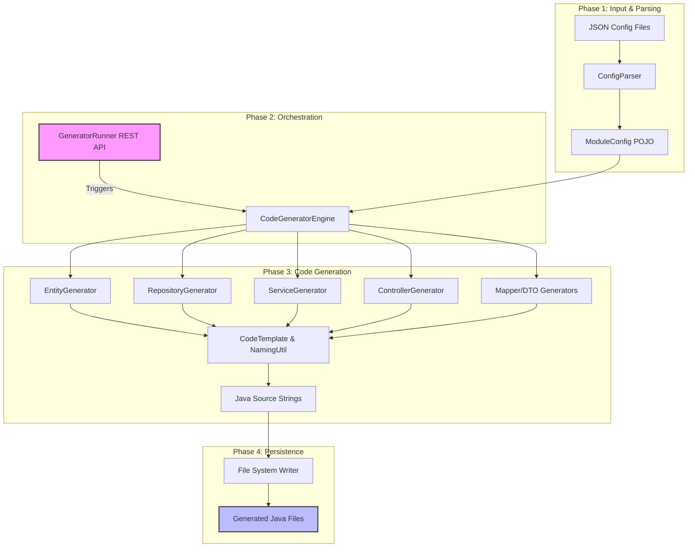

# 🛠️ Master Page Code Generation System — Documentation

## 1. 🎯 Objective
The primary objective of this project is to **automate the generation of boilerplate code** for "Master Modules" (Administrative Reference Data). 

In a healthcare system, many tables exist purely for reference (e.g., Hospital Types, States, Cities, Pharmacy Categories). Manually creating the Entity, Repository, Service, DTOs, and Controllers for each of these is repetitive and error-prone. This system allows a developer to define the data structure once in a JSON file and generate a fully functional, production-ready REST API in seconds.

## 2. 🔍 Scope
The system currently automates the generation of the following Spring Boot components:
*   **JPA Entities:** Supported with UUID v7, soft-delete, and full audit trails.
*   **Data Access Layers:** Spring Data JPA Repositories with custom query methods for filtering and projections.
*   **Business Logic:** Service interfaces and implementations with transaction management and validation.
*   **API Layer:** REST Controllers with standard CRUD, pagination, and search endpoints.
*   **Data Transformation:** DTOs (Request/Response) and MapStruct-style mappers.
*   **UI Helpers:** Projection-based dropdown models for frontend integration.

## 3. 📥 Input / 📤 Output
| Type | Format | Description |
| :--- | :--- | :--- |
| **Input** | `JSON Config` | A metadata file located in `src/main/resources/generator-configs/` (e.g., `mst_pharmacy.json`). |
| **Output** | `Java Source` | Multiple `.java` files generated in the specified package (e.g., `com.healthcare.pharmacy.*`). |

---

## 4. 🗺️ How it Works (Data Flow & Architecture)

### 🔄 Code Generation Workflow
The following diagram illustrates the flow from a JSON configuration to the final Java source files on disk.



---

## 5. 📦 Module Breakdown

### 🛠️ Core Utilities (`core` package)
*   **`NamingUtil`**: The "brain" for naming conventions. It handles conversions between `snake_case` (DB), `PascalCase` (Classes), `camelCase` (Fields), and `kebab-case` (URL paths).
*   **`CodeTemplate`**: A fluent, indentation-aware API used to build Java source code programmatically without messy `StringBuilder` logic.
*   **`ImportRegistry`**: Dynamically tracks and organizes Java `import` statements, ensuring only necessary imports are added and duplicates are avoided.

### ⚙️ Engine (`engine` package)
*   **`ConfigParser`**: Loads JSON files from the classpath and maps them to the `ModuleConfig` object model.
*   **`CodeGeneratorEngine`**: The main orchestrator that calls each generator in the correct order and saves the resulting strings to the local file system.

### 🧩 Specific Generators (`moduler` package)
*   **`EntityGenerator`**: Produces a JPA Entity with `@Table` constraints, `@Column` definitions, and `@PrePersist` hooks for security audits.
*   **`RepositoryGenerator`**: Creates a Spring Data Repository that includes custom `@Query` logic for global searching and soft-delete filtering.
*   **`ServiceGenerator`**: Generates a Service interface and its Implementation, including complex unique constraint checks (checking if a value exists but skipping the current record's ID during updates).
*   **`ControllerGenerator`**: Builds a REST Controller with endpoints for `create`, `update`, `get`, `delete`, `search`, and `status-toggle`.

### 🚀 Execution (`runner` package)
*   **`GeneratorRunner`**: A developer-only REST API (enabled via `@Profile("dev")`) that allows you to trigger generation via Postman or Curl.
    *   `POST /api/v2/generator/generate?config=mst_pharmacy`

---

## 6. 📝 Example Configuration Summary
When you define a field like this in JSON:
```json
{ "name": "pharmacyName", "columnName": "pharmacy_name", "type": "String", "searchable": true }
```
The system automatically:
1.  Creates a `pharmacyName` field in the **Entity**.
2.  Adds validation to the **RequestDTO**.
3.  Includes it in the **Projections**.
4.  Adds it to the **Global Search** query in the Repository.
5.  Updates the **Mapper** to handle the field transition.

---
> [!NOTE]
> This documentation is maintained as part of the `Healthcare_Resource_and_Appointment_Optimization_Backend_System`. Always check `v2` generators for the latest patterns.
